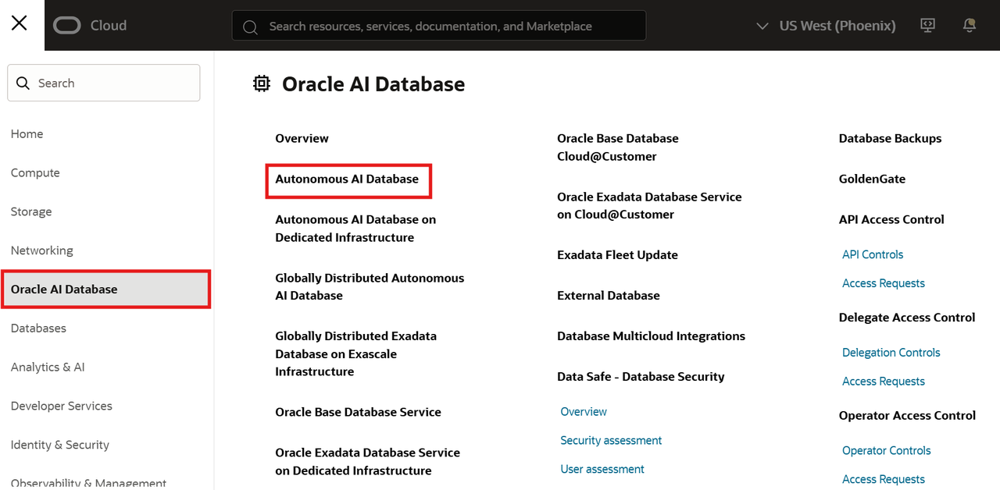

# Get Ready

## Introduction

This workshop uses the same Autonomous AI Database and model setup as the MongoDB API movie-search workshop. You will work in Database Actions or another SQL client, so you do not install MongoDB Shell or create a MongoDB API connection.

Estimated Time: 15 minutes

### Objectives

- Sign in to OCI and open the workshop database.
- Open a SQL worksheet for the database.
- Download both supplied ONNX models, upload them to separate Object Storage folders, and create a PAR URL for each model.

## Task 1: Sign in to OCI and open the database

1. Sign in to [Oracle Cloud Infrastructure](https://cloud.oracle.com/) with the workshop credentials or your OCI tenancy credentials.

2. Open the OCI navigation menu, select **Oracle AI Database**, and then select **Autonomous AI Database**.

    

3. Select the compartment supplied for your workshop.

4. Open the provisioned Autonomous AI Database and confirm that its lifecycle state is **Available**.

5. Select **Database Actions**, and then open **SQL**.

    

6. Keep the SQL worksheet open in a browser tab.

## Task 2: Prepare both embedding models in Object Storage

1. Download the [multilingual E5-small model archive](https://adwc4pm.objectstorage.us-ashburn-1.oci.customer-oci.com/p/3ZkNN9ORHrCvTFBx5wXh_UnWT5SkudyzqzOFWkEwcDW32yRA1ZbOF-qeG-KQK7ba/n/adwc4pm/b/OML-ai-models/o/multilingual_e5_small_augmented.zip) to your computer.

    - Extract the archive into a separate local folder, such as `models/e5-small/`, and locate `multilingual_e5_small.onnx`.
    - E5-small produces 384-dimensional vectors.

2. Download the [multilingual E5-base model archive](https://objectstorage.us-ashburn-1.oraclecloud.com/p/SixA8FrMqul15N-qFEm5EsxusdyVzxEarw_GVAoNesn13VFy0EtdEsGUhtU0i8S8/n/adwc4pm/b/OML-ai-models/o/multilingual_e5_base_augmented.zip) to your computer.

    - Extract the archive into a different local folder, such as `models/e5-base/`, and locate `multilingual_e5_base.onnx`.
    - E5-base produces 768-dimensional vectors.

The embedding model shapes semantic-search quality. Models represent meaning differently. More dimensions can capture finer distinctions and may improve results. This workshop provides E5-small and E5-base for a consistent lab experience. You are welcome to bring a compatible ONNX model, using its dimension count when you define the vector column.

3. Open the OCI navigation menu. Select **Storage**, then **Buckets**. Select the workshop compartment, and create or open a bucket for the models.

    

4. Upload the extracted `multilingual_e5_small.onnx` file, not the ZIP archive, to a folder such as `models/e5-small/`.

5. Upload the extracted `multilingual_e5_base.onnx` file to a different folder, such as `models/e5-base/`.

6. Open the menu for each uploaded ONNX file and select **Create Pre-Authenticated Request**. Allow **Object Read** access, set an expiry date after your workshop session, and copy each PAR URL.

    - Copy the E5-small PAR URL. You will use it to load the model in Lab 2.
    - Copy the E5-base PAR URL. You will use it to load the model in Lab 3.

If you want to learn more, see [AI Vector Search Overview](https://docs.oracle.com/en/database/oracle/oracle-database/26/vecse/overview-ai-vector-search.html).

## Task 3: Confirm your SQL workspace

1. In Database Actions, confirm that you can run a simple query in the SQL worksheet.

    ```sql
    SELECT CURRENT_USER FROM dual;
    ```

    Keep this worksheet open. The remaining labs use SQL only.

## Acknowledgements

* **Author** - Gael Palomino
* **Last Updated By/Date** - Gael Palomino, August 2026
